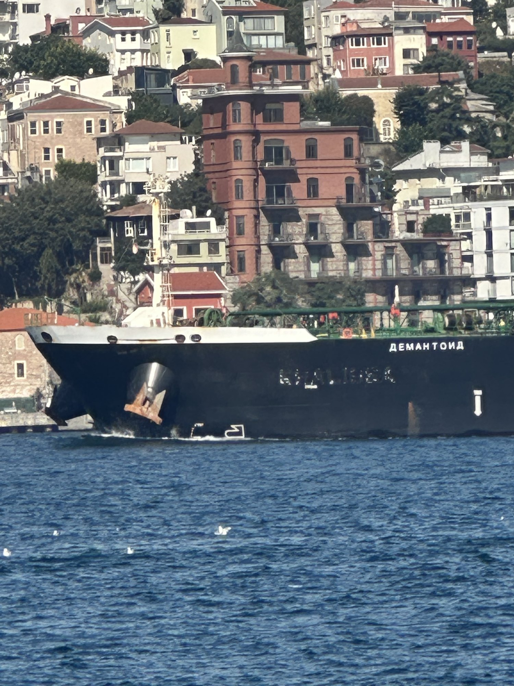
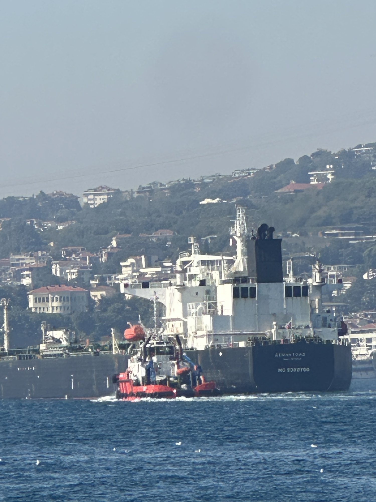
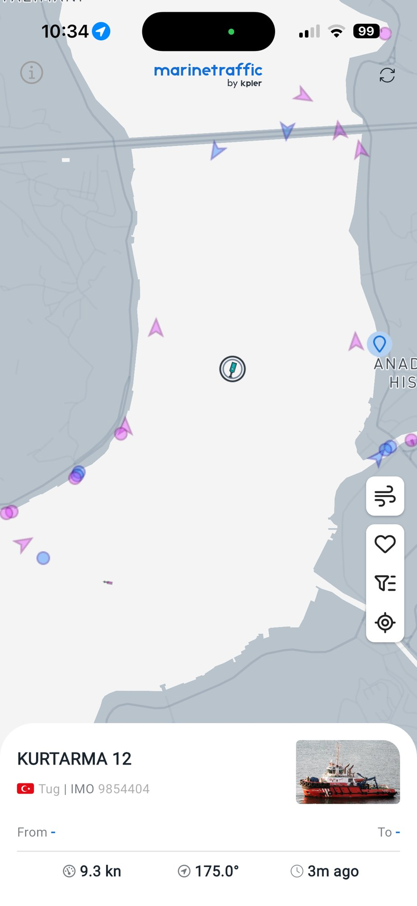

when i spotted this giant tanker with a clearly rushed name change to cyrillic (DEMANTOID,
imo 9388780, sanctioned). quickly pulled up marinetraffic only to find that it was not
broadcasting AIS; the tug's signal is visible, but the tanker's wasn't in the bosporus. it
was around 100km north in the black sea (in fact, as of a few minutes ago, it still
apparently: [marinetraffic.com/…/shipid:726867](https://www.marinetraffic.com/en/ais/details/ships/shipid:726867))

```{=html}
<div class="tiles three">
  <figure><a href="figures/demantoid/img_7986.jpg"></a><figcaption>ДЕМАНТОИД, with the old name still showing through the paint</figcaption></figure>
  <figure><a href="figures/demantoid/img_7988.jpg"></a><figcaption>stern, with the KEGM tug KURTARMA 12 alongside</figcaption></figure>
  <figure><a href="figures/demantoid/img_7989.jpg"></a><figcaption>MarineTraffic at that moment: the tug, and nothing where the tanker is</figcaption></figure>
</div>
```

i checked our AIS data, and sure enough it had been broadcasting a static position for the
past two weeks. i looked for other static AIS broadcast, and quickly found 7 more sanctioned
tankers doing the exact same thing. but in their ~two week spoof, ghostship tracks them
nicely hugging the turkish coast and going to russia:

::: {.embed}
[open full-screen ↗](interactive/frozen_fleet_map.html)
```{=html}
<iframe src="interactive/frozen_fleet_map.html" loading="lazy" title="Map: the eight frozen transmitters — broadcast position vs where Sentinel-2 re-identified the hull"></iframe>
```
✕ = the position each MMSI was broadcasting while frozen. Dots = every dark Sentinel-2
detection GhostShip re-identified to that hull between its entry into the Black Sea and its
exit, numbered and linked in date order (click for the chip). Click a name to isolate one hull.
:::

::: {.embed}
[open full-screen ↗](interactive/dark_tankers_map.html)
```{=html}
<iframe src="interactive/dark_tankers_map.html" loading="lazy" title="Map: every dark tanker detection in the Black Sea in 2026, one colour per re-identified hull"></iframe>
```
Every dark tanker detection in the Black Sea in 2026, one colour per re-identified hull.
Dark ring = sanctioned. Click a dot to isolate that hull and link its detections in date order.
:::

it seemed insane to me that a vessel could transit the bosporus while spoofing. Looked into
it, and Turkey requires a pilot to take over the vessel to transit (and usually an
accompanying tugboat as well, all of whom are employed by the Turkish government). Another
cool thing is that they announce crossings in real time on their website. as i was looking
at the website, i could see that two of the 7 remaining frozen tankers had filed a crossing
plan for the next day.

so i slapped together this app: [straitwatch.twitcher.cc](https://straitwatch.twitcher.cc/).
I found 6 high resolution web cams that have full coverage of the bosporus, and started
running YOLO tanker/cargo detection on them, cross referencing automatically with the
crossing schedule. now it saves 10-20 images per vessel from different angles as they cross

::: {.embed .tall}
[open full-screen ↗](crossing/)
```{=html}
<iframe src="crossing/" loading="lazy" title="Webcam pictures of the two crossings, camera by camera"></iframe>
```
:::

the next day, i woke up around 6 am to catch the two spoofing sanctioned tankers crossing
(PIROP, 9257022 and KHRIZOPRAZ, 9337901 both of whom are still broadcasting their spoofed
position in the black sea today).
[PIROP on marinetraffic](https://www.marinetraffic.com/en/ais/details/ships/shipid:730500/mmsi:273128820/imo:9257022/vessel:PIROP) ·
[KHRIZOPRAZ on marinetraffic](https://www.marinetraffic.com/en/ais/details/ships/shipid:10060946/mmsi:273123820/imo:9337901/vessel:KHRIZOPRAZ)

The webcams caught them and i made this supercut of their crossings.

```{=html}
<div class="videos">
  <figure><video controls preload="metadata" src="crossing/video/supercut_khrizopraz.mp4"></video><figcaption>KHRIZOPRAZ, 8×, six cameras, 2026-09-08 07:24–08:01 local</figcaption></figure>
  <figure><video controls preload="metadata" src="crossing/video/supercut_pirop.mp4"></video><figcaption>PIROP, 8×, six cameras, 2026-09-08 08:44–09:29 local</figcaption></figure>
</div>
```

one interesting wrinkle was that while MarineTraffic showed their spoofed frozen position in
the black sea, i could see their AIS track on Vesselfinder. Afterwards, i queried our own
data and found that these hulls broadcast two AIS signals simultaneously: a real one, which
is satellite capable, and a terrestrial one with the spoofed position. it seems they briefly
turn the real broadcast on during the crossing, but leave the spoofing one running at the
same time. i guess Marinetraffic and Vesselfinder have different ways of picking between two
simultaneous MMSI broadcasts.

::: {.embed .short}
[open full-screen ↗](interactive/dual_stream_gantt.html)
```{=html}
<iframe src="interactive/dual_stream_gantt.html" loading="lazy" title="One MMSI, two transmitters: fixed and moving lanes per hull"></iframe>
```
:::

::: {.embed}
[open full-screen ↗](interactive/dual_stream_map.html)
```{=html}
<iframe src="interactive/dual_stream_map.html" loading="lazy" title="Map: the fixed transmitter against the same MMSI's moving track"></iframe>
```
✕ = the fixed transmitter. Line = the same MMSI's moving broadcast, hour by hour, 12 Aug – 6 Sep.
:::

for good measure, i also took some pictures with a DSLR camera. KHRIZOPRAZ also had the
rushed-paintjob-name.



if you look closely on the bridge, you'll see anti-drone netting that some tankers are using
these days, which i think is the root cause of all of this. Ukraine struck 13 tankers in the
past year. this map combines their last AIS message (stars, likely strike locations), with
the ghostship-reidentified resting place

::: {.embed}
[open full-screen ↗](interactive/strikes_map.html)
```{=html}
<iframe src="interactive/strikes_map.html" loading="lazy" title="Map: drone strikes on tankers (stars) and where GhostShip re-identified each hull afterwards"></iframe>
```
★ = strike, placed from the victim's own last AIS message (hollow = placed from reported
wording). ● = where the hull was re-identified afterwards, sized by days it sat there.
:::

notice from the above, that the strike locations are in the middle of the black sea. then,
look back at the map of ghostship re-ids of these spoofing tankers: they are all staying more
or less in the Turkish EEZ, going the long way around

another detail i noticed was that KHRIZOPRAZ, PIROP, and DEMANTOID are all gemstone names in
russian, and all three were renamed within days of each other. i found 31 more vessels
displaying the same pattern. all sanctioned, bearing Russian names for gemstones, reflagged to
Russia within a few weeks of each other (as recent as last week), all tech managed by a
random hong kong shell company: "[chinese mountain or river] Shipmanagement Co"

::: {.embed .tall}
[open full-screen ↗](interactive/gemstone_roster.html)
```{=html}
<iframe src="interactive/gemstone_roster.html" loading="lazy" title="The gemstone fleet: sortable roster"></iframe>
```
:::
