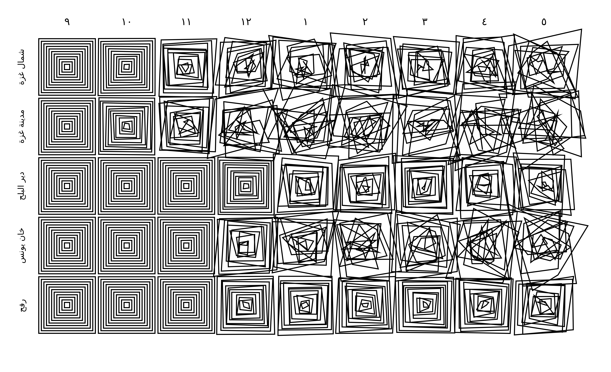
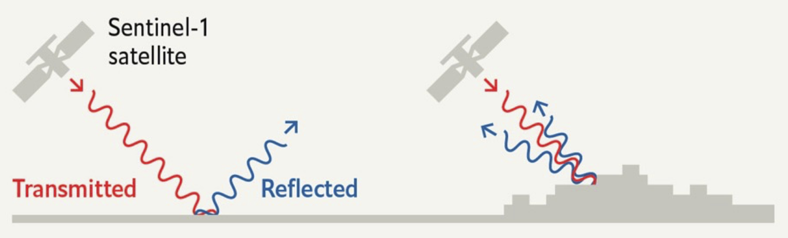
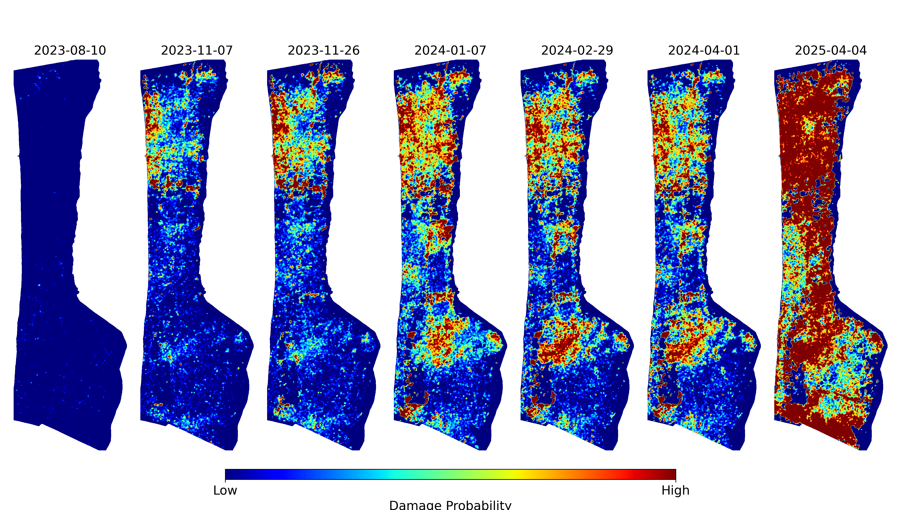
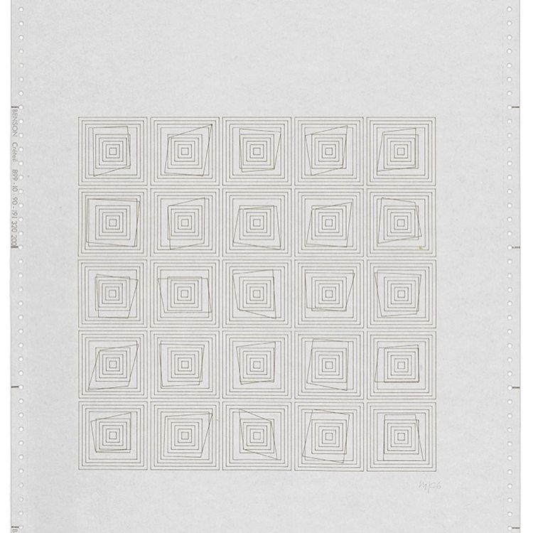
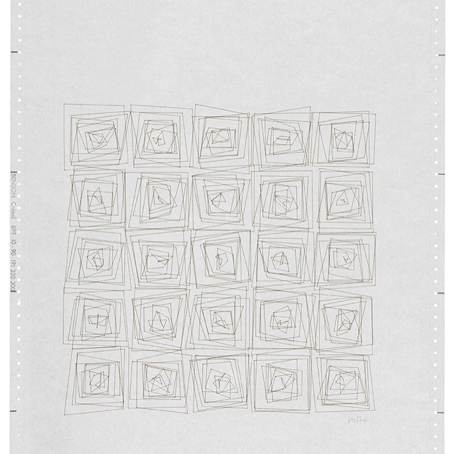
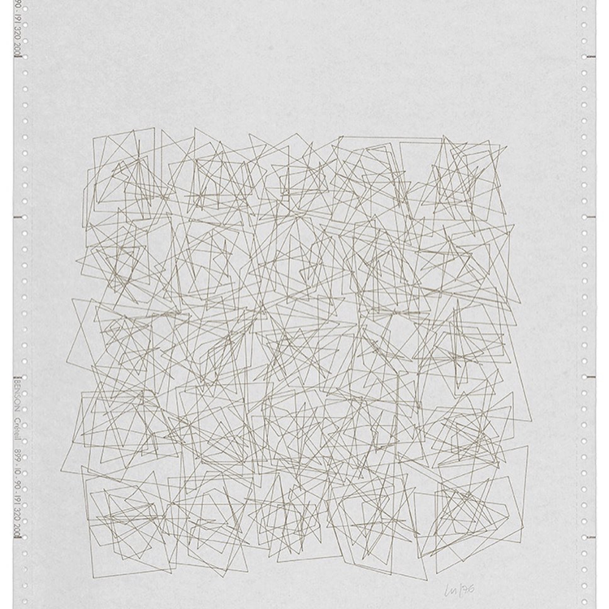
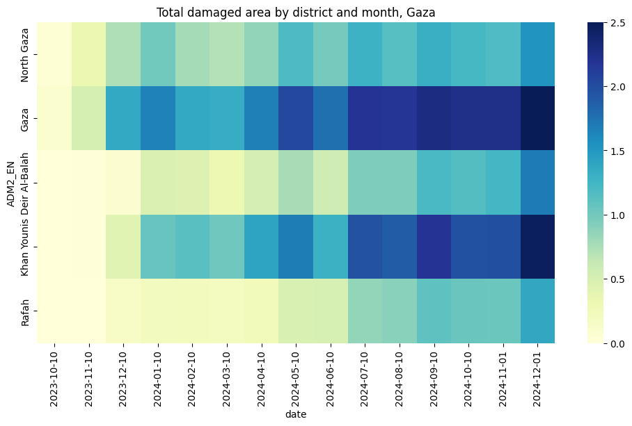

---
format:
  html:
    theme: flatly
    code-fold: true
    eval: false
    code-summary: "Show code"
---

:::{.column-screen}

{width=100%}

:::


# Nothing Beside Remains

The image above is a representation of building damage in the Gaza Strip during the first eight months of the genocide. The rows are the five Governorates of Gaza; North Gaza, Gaza City, Deir al-Balah, Khan Yunis, and Rafah. The columns correspond to the months from September 2023 to May 2024, when the proportion of damaged buildings across Gaza tipped over 50%. Each cell contains a grid of concentric squares, wherein the amount of 'jitter' is proportional to the amount of building damage measured in that Governorate during that month. The more damage, the more chaotic the squares become.

For the past two years, I've been working on a method to measure building damage in conflict zones using satellite imagery. It performs a simple statistical test on publicly available imagery from a radar satellite to detect whether a pixel has changed significatly since the onset of a conflict. The code to generate damage estimates is now [open source](https://github.com/oballinger/PWTT/tree/main), and after four rounds of peer review, the methodology is now published [(open access)](https://www.sciencedirect.com/science/article/pii/S0034425725004298) in a scientific journal. The paper contains 20 figures and 15 tables, assessing the accuracy of the algorithm against manual building damage annotations from the UN, accounting for lateral damage to buildings, comparisons to existing methods, and further testing in Syria, Iraq, Sudan, and Ukraine.

These figures and maps are already an abstraction of reality. But somehow, further abstraction brings us closer to the emotional truth of the situation. This visual project emerged as a way of processing the grief that comes from measuring a genocide. The horror, in the early months, of watching entire neighbourhoods turn to dust, of triple checking the results and hoping that they were wrong. The slow, sinking realization, as the count of damaged buildings ticked past 30%, 50%, 80%, that this was not going to stop. To me, these jittery squares convey the overwhelming violence of this campaign of annihilation and the fragility of the "peaceful" order that preceded it more viscerally than any of the quantitative results. 

In what follows, I describe the science behind the damage detection method, and the art that inspired this representation of the data. The code to generate this visualization is provided throughout. 

## Science


The accurate and timely identification of buildings damaged by war is crucial information for local civilians, aid agencies, and an informed public. Recent progress has been made in automatically identifying damaged buildings using deep learning and very-high resolution (VHR) optical satellite imagery. However, these models often struggle to generalize and are both financially and computationally expensive. As such, there has been little uptake of these methods by humanitarian practitioners such as the United Nations Satellite Agency (UNOSAT), which continues to identify damaged buildings by manually combining through satellite imagery.

The sourcing of this imagery is also politically precarious. Maxar, a private company that derives most of its revenue from military contracts, donates high resolution imagery to the U.S. State Department, which donates it to the UN Satellite Agency (UNOSAT). Until recently, it was [illegal](https://www.npr.org/2023/11/16/1212889717/satellite-images-us-israel-gaza) for American private companies to release high resolution of Israel and the occupied territories. 


“SAR instruments send pulses of microwaves toward Earth’s surface and listen for the reflections of those waves. The radar waves can penetrate cloud cover, vegetation, and the dark of night to detect changes that might not show up in visible light imagery. When buildings have been damaged or toppled, the amplitude of radar wave reflections changes in those areas and indicates to the satellite that something on the ground has changed.”

{width=100%}


::: {.column-screen}

{width=100%}

:::


:::{.column-screen}
{width=100%}
:::


## Art


> “This may sound paradoxical, but the machine, which is thought to be cold and inhuman, can help to realise what is most subjective, unattainable, and profound in a human being” -- Vera Molnár

A year into the work on building damage detection, I went to the Tate Modern with a friend to see and exhibition titled "Electric Dreams: Art and Technology Before the Internet". There, I saw *Transformations (Átalakulás) 1-21* (1976), a series of twenty-one computer plotter drawings. The drawings, by Vera Molnár, are preserved in their original format: at the top of the Benson sheet are the day, date and exact time of the computer print-out. 

Each drawing shows a different stage in the progression of a five by five grid of concentric squares. Molnár programmed a computer algorithm to randomly disrupt the regularity of the concentric squares. As the title indicates, the sequence of plotter drawings shows the transformation of squares across twenty-one drawings, from a state of order to one of disorder. As the sequence progresses, an impression of movement is generated, as if the squares are vibrating against one another. The final sheets in the series are a chaotic jumble of lines:

::: {.column-screen layout-ncol=3}

{width=100%}

{width=100%}

{width=100%}

:::

My friend and I stood transfixed in front of these drawings for a long time. I didn't know at the time why I found these squiggles so compelling. 
I had spent most of my waking hours in the past year watching, from space, the progression from order into chaos.

When I got home, 

<!-- Molnár was influenced by Dadism, which was born out of a reaction to the horrors of the First World War. Dadaists beleif that the 'reason' and 'logic’ of bourgeois capitalist society had led people into war leads them to reject logic and embrace chaos and irrationality.“I love order but I can’t stand it. So the method that I have found in order to live in peace with myself and with order, is that I make ordered structures and I put in – include, inject, that’s how to say it – 1% of chaos. Why 1%? Because I love to make things specific. Maybe it’s not 1% but 2% and with age it becomes more and more. And even that doesn’t come from a change in taste but from a change in mental capacities: I make mistakes, I stutter, I mix up my words. And so it is that chaos perhaps came from this” -->


```{python}
#| code-fold: true
#| code-summary: "Show Python Code"
#| eval: false
import matplotlib.pyplot as plt
import numpy as np
from matplotlib.patches import Polygon
from matplotlib import rcParams
import datetime
import sys
import os

# Configure global font settings
rcParams['font.family'] = 'monospace'

# Create directory for saving transformations
os.makedirs("transformations", exist_ok=True)

def make_polygon(ax, center_x, center_y, width=1, height=1, scaling_factor=0.1, color='black'):
    """
    Draw nested polygons with random corner adjustments.
    """
    for i in range(11):  # Number of polygons
        cw, ch = width + i * 0.5, height + i * 0.5  # Incremental scaling
        offsets = {corner: (np.random.uniform(-scaling_factor, scaling_factor),
                            np.random.uniform(-scaling_factor, scaling_factor))
                   for corner in ['top_left', 'top_right', 'bottom_right', 'bottom_left']}
        vertices = [
            (center_x - cw / 2 + offsets["top_left"][0], center_y + ch / 2 + offsets["top_left"][1]),
            (center_x + cw / 2 + offsets["top_right"][0], center_y + ch / 2 + offsets["top_right"][1]),
            (center_x + cw / 2 + offsets["bottom_right"][0], center_y - ch / 2 + offsets["bottom_right"][1]),
            (center_x - cw / 2 + offsets["bottom_left"][0], center_y - ch / 2 + offsets["bottom_left"][1])
        ]
        ax.add_patch(Polygon(vertices, closed=True, facecolor='none', edgecolor=color))

def create_polygons(grid_size=5, width=1, height=1, spacing=3, scaling_factor=0.1):
    """
    Draw polygons on a single large set of axes in a grid.
    """
    fig, ax = plt.subplots(figsize=(5.8, 8.3))
    for i in range(grid_size):
        for j in range(grid_size):
            make_polygon(ax, center_x=j * spacing, center_y=-i * spacing,
                         width=width, height=height, scaling_factor=scaling_factor)
    ax.set_xlim([-spacing, grid_size * spacing])
    ax.set_ylim([-grid_size * spacing, spacing])
    ax.set_aspect('equal')
    ax.axis('off')
    plt.tight_layout()
    return fig

# Generate and save transformations
for i in range(20):
    scaling_factor = 0.1 * i
    fig = create_polygons(grid_size=5, width=0.5, height=0.5, spacing=5.79, scaling_factor=scaling_factor)

    now = datetime.datetime.now().strftime("%Y-%m-%d %H:%M:%S")
    plt.title(f"\n\n{now}     JITTER: {np.round(scaling_factor, 3)}\nJOB FROM PYTHON {sys.version[:8]}", fontsize=9)
    plt.savefig(f'transformations/transformations_{i}.png', dpi=300)
    plt.show()

```


<iframe src='transformations.html' width='100%' height='1200px'></iframe>


## Combining the two


```{python}
#| code-fold: true
#| code-summary: "Show Python Code"
#| eval: false

import seaborn as sns
import matplotlib.pyplot as plt
import os
import geopandas as gpd
import pandas as pd
from shapely.geometry import shape
import json
import numpy as np
import gdown

folder_id = "1mpMqGYcjkQ7g_q4eW0WVmnnXqGe-mNvU"
dest="../data/gaza_molnar"

!mkdir -p $dest
gdown.download_folder(url=f"https://drive.google.com/drive/folders/{folder_id}", output=dest, quiet=False)

df=pd.DataFrame()

for root, dirs, files in os.walk(dest):
    for file in files:
        if file.endswith(".csv"):
            temp = pd.read_csv(os.path.join(root, file))
            date=file.split("_")[1]
            temp["date"]=pd.to_datetime(date)
            df=pd.concat([df,temp])

df.reset_index(inplace=True)
df.rename(columns={"index":"grid_id"},inplace=True)
df.sort_values(by=['grid_id','date'],inplace=True)

df['date']=pd.to_datetime(df['date'], format='%Y%m%d')
df['date']=df['date'].dt.strftime('%Y-%m-%d')

df['damage']=np.where(df['k50']>3,1,0)

df['geometry'] = df['.geo'].apply(lambda x: shape(json.loads(x)))
gdf=gpd.GeoDataFrame(df, geometry='geometry', crs="EPSG:3857")
adm=gpd.read_file("../data/gaza_molnar/palestine_admin_bounds/pse_admbnda_adm2_pamop_20231019.shp")
adm=adm.to_crs("EPSG:3857")
adm=adm[adm['ADM1_PCODE']=='PS02'][['geometry','ADM2_EN']]
order=adm['ADM2_EN'].unique()

gdf=gpd.sjoin(gdf, adm, how="inner")
grouped=gdf.groupby(['ADM2_EN','date'])['damage'].sum().unstack().T
grouped=grouped[order].T
min_=grouped.min().min()
max_=grouped.max().max()
#normalize from 0 to 2
grouped=(grouped-min_)/(max_-min_)*2.5
array=grouped.to_numpy()
#add column of zeros to the left
array=np.hstack((np.zeros((array.shape[0],1)),array[:,:-1]))
plt.figure(figsize=(12,6))
plt.title('Total damaged area by district and month, Gaza')
sns.heatmap(grouped, cmap="YlGnBu")

```


{width=100%}

The code below generates the same pattern of concentric squares as Transformations, but instead of using a random entropy value, it scales the entropy according to the total damaged are in a given district of the Gaza strip, in a given month. The names of the districts are written in arabic on the left, and the numbers of the months (starting in 09/2023) are indicated above each column.

```{python}
#| code-fold: true
#| code-summary: "Show Python Code"
#| eval: false
import matplotlib.pyplot as plt
import numpy as np
from matplotlib.patches import Polygon
from matplotlib import rcParams
import os
import arabic_reshaper
from bidi.algorithm import get_display

def reshape_arabic(text):
    return get_display(arabic_reshaper.reshape(text))

# Create directory for saving transformations
os.makedirs("../figs/transformations", exist_ok=True)

def make_polygon(ax, center_x, center_y, width=1, height=1, scaling_factor=0.1, color='black'):
    """
    Draw nested polygons with random corner adjustments.
    """
    for i in range(11):  # Number of polygons
        cw, ch = width + i * 0.5, height + i * 0.5  # Incremental scaling
        offsets = {corner: (np.random.uniform(-scaling_factor, scaling_factor),
                            np.random.uniform(-scaling_factor, scaling_factor))
                   for corner in ['top_left', 'top_right', 'bottom_right', 'bottom_left']}
        vertices = [
            (center_x - cw / 2 + offsets["top_left"][0], center_y + ch / 2 + offsets["top_left"][1]),
            (center_x + cw / 2 + offsets["top_right"][0], center_y + ch / 2 + offsets["top_right"][1]),
            (center_x + cw / 2 + offsets["bottom_right"][0], center_y - ch / 2 + offsets["bottom_right"][1]),
            (center_x - cw / 2 + offsets["bottom_left"][0], center_y - ch / 2 + offsets["bottom_left"][1])
        ]
        ax.add_patch(Polygon(vertices, closed=True, facecolor='none', edgecolor=color, linewidth=lw))

def create_polygons(grid_size=(5, 12), width=1, height=1, spacing=3, scaling_factors=None):
    """
    Draw polygons on a grid with different scaling factors for each cell.
    """
    if scaling_factors is None:

        scaling_factors = np.full(grid_size, 0.1)

    names = [reshape_arabic(name) for name in ['شمال غزة', 'مدينة غزة', 'دير البلح', 'خان يونس', 'رفح']]
    headers = [reshape_arabic(h) for h in ['٩','١٠','١١','١٢','١','٢','٣','٤','٥','٦','٧','٨','٩','١٠']]

    fig, ax = plt.subplots(figsize=(w,h))  # Adjust figsize as per the grid size

    for i in range(grid_size[0]):  # Iterate over rows
        ax.text(-4, -i * spacing, names[i], ha='right', va='center', fontsize=fontsize, rotation=90)
        for j in range(grid_size[1]):  # Iterate over columns
            scaling_factor = scaling_factors[i, j]  # Get the scaling factor for this cell
            make_polygon(ax, center_x=j * spacing, center_y=-i * spacing,
                         width=width, height=height, scaling_factor=scaling_factor)
            if i==0:
                if paper=='a3':
                    ax.text(j * spacing, h*.35, headers[j], ha='center', va='center', fontsize=fontsize+4)
                else:
                    ax.text(j * spacing, h*.75, headers[j], ha='center', va='center', fontsize=fontsize+2)

    ax.set_xlim([-spacing, grid_size[1] * spacing])  # Adjust x-axis limits
    ax.set_ylim([-grid_size[0] * spacing, spacing])  # Adjust y-axis limits
    ax.set_aspect('equal')

    ax.axis('off')
    plt.tight_layout()
    return fig


#rcParams['font.family'] = 'monospace'
#rcParams['font.family'] = 'Times New Roman'

colnum=9
paper='a5'

if paper=='a3':
    w,h=16.5,11.7
    lw=1.8
    fontsize=12
    dpi=500
elif paper=='a4':
    w,h=11.7,8.3
    lw=1
    fontsize=8
elif paper=='a5':
    w,h=8.3,5.8
    lw=1
    fontsize=8
    dpi=1000

fig = create_polygons(grid_size=(5,colnum), width=0.5, height=0.5, spacing=5.79, scaling_factors=array)
plt.show()
fig.savefig(f"../figs/transformations/transformations_gaza_{paper}.png", dpi=dpi, bbox_inches='tight')
```
